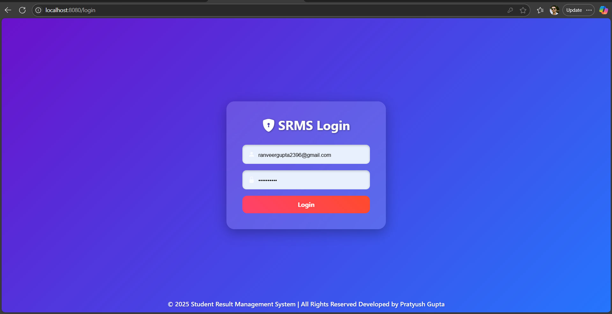
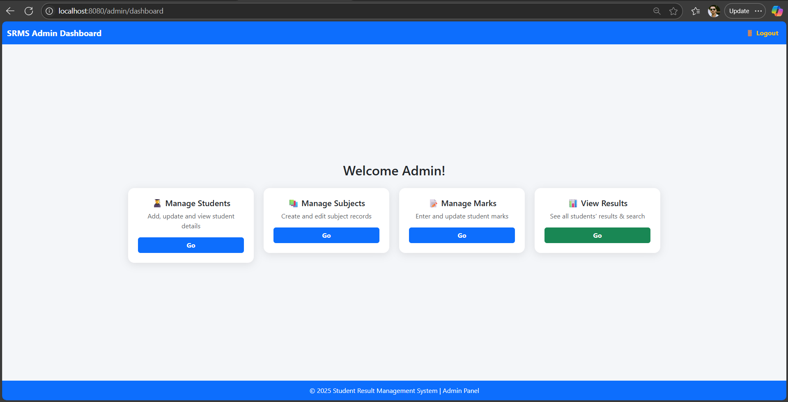
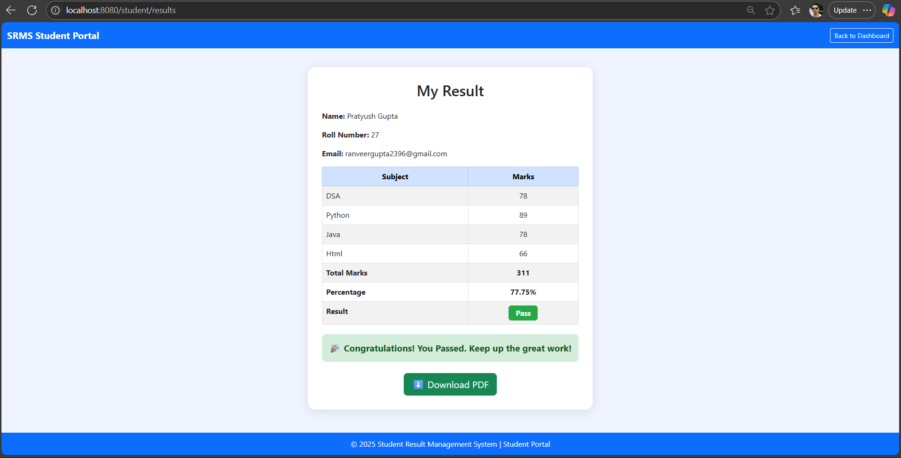
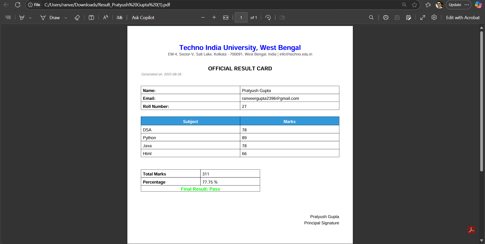
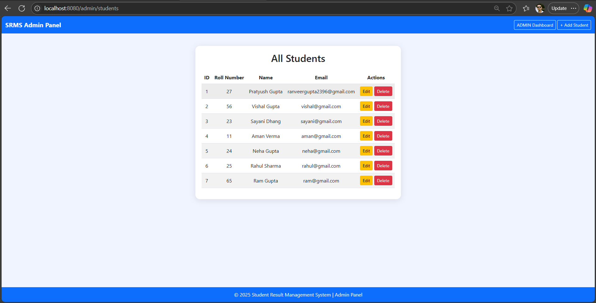
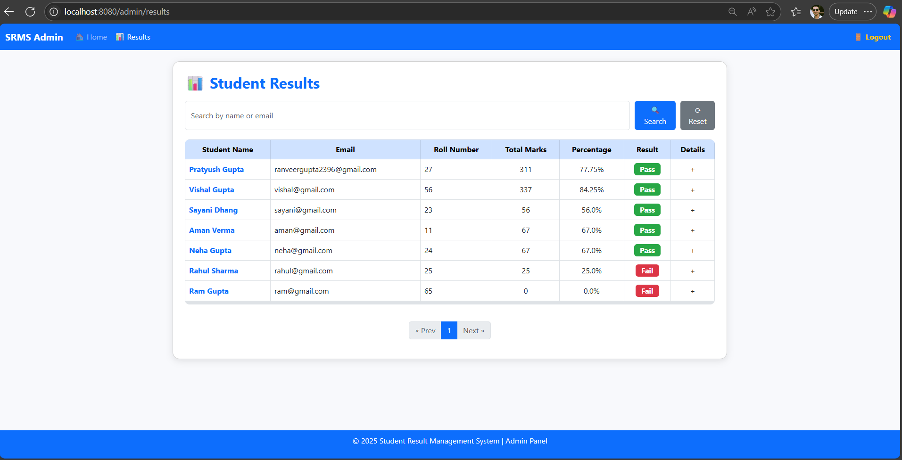

# 🎓 Student Result Management System (SRMS)

A **full-featured Student Result Management System** built with **Spring Boot**, **Thymeleaf**, **PostgreSQL**, and **Bootstrap**.  
This system allows **Admins** to manage students, subjects, and marks, while **Students** can view and download their results as **PDF**.  

---

## ✨ Features

### 🔑 Admin Panel
- 📊 **Dashboard** – Quick overview & navigation  
- 👨‍🎓 **Manage Students** – Add, edit, delete students with roll numbers  
- 📚 **Manage Subjects** – Add, edit, delete subjects  
- 📝 **Manage Marks** – Assign marks per subject (no duplicates)  
- 📖 **View Results** – Paginated results, search by name/email, expand for subject-wise marks  
- ✅ **Pass/Fail** – Auto calculated based on marks  

### 🎓 Student Panel
- 🏠 **Dashboard** – Personalized welcome message  
- 📄 **View Results** – Subject-wise marks, total, percentage, and final result  
- ⬇️ **Download Result as PDF** – With university header and student details  

### 🔒 Security
- 👤 **Role-Based Authentication** (Admin & Student login)  
- 🔑 **Spring Security** – Password encryption & access control  

---

## 🛠 Tech Stack

| Layer       | Technology |
|-------------|------------|
| **Backend** | Java 17, Spring Boot, Spring MVC, Spring Security |
| **Frontend**| Thymeleaf, HTML5, CSS3, Bootstrap 5 |
| **Database**| PostgreSQL |
| **PDF**     | OpenPDF / iText |
| **Build**   | Maven |

---

## 📂 Project Structure

```plaintext
student-result-management-system/
├── backend/
│ ├── src/main/java/com/example/studentdb/
│ │ ├── controller/ # 🎯 MVC Controllers (Admin & Student endpoints)
│ │ ├── entity/ # 🗂 JPA Entities (Student, Subject, Mark, User)
│ │ ├── repository/ # 💾 Spring Data JPA Repositories
│ │ ├── dto/ # 📦 Data Transfer Objects (Result DTOs, etc.)
│ │ ├── service/ # ⚙️ Business Logic Layer (Student, Result, Mark services)
│ │ └── security/ # 🔐 Spring Security Configuration (Roles & Authentication)
│ │
│ ├── src/main/resources/
│ │ ├── templates/ # 🖼 Thymeleaf HTML Templates (Admin, Student views)
│ │ ├── static/ # 🎨 CSS, JS, Images, Bootstrap files
│ │ └── application.properties # ⚡ Spring Boot App Configuration
│ │
│ ├── src/test/ # 🧪 Unit & Integration Tests
│ └── pom.xml # 📋 Maven Configuration
│
├── database/
│ ├── schema.sql # 🏗 Database Schema (PostgreSQL/MySQL)
│ └── seed.sql # 🌱 Sample Data for Testing
│
├── docs/ # 📘 Project Documentation, diagrams, API reference
└── README.md # 📄 Project Overview

```
---
## 📸 Screenshots

### 🖥 Login Page


### 🖥 Admin Dashboard


### 🖥 Student Dashboard


### 👨‍🎓 Student Result Page


### 📄 Download as PDF


### 🖥 Manage Student


### 🖥 All Student Result


---

## ✨ Features Tables

| Feature         | Admin | Student |
| --------------- | ----- | ------- |
| Dashboard       | ✅     | ✅       |
| Manage Students | ✅     | ❌       |
| Manage Subjects | ✅     | ❌       |
| Add Marks       | ✅     | ❌       |
| View Results    | ✅     | ✅       |
| Download PDF    | ❌     | ✅       |

---

## How to Run

## Clone the repository:
```
git clone https://github.com/yourusername/studentdb.git
```

## Setup PostgreSQL and update application.properties:
```
spring.datasource.url=jdbc:postgresql://localhost:5432/studentdb
spring.datasource.username=yourusername
spring.datasource.password=yourpassword
spring.jpa.hibernate.ddl-auto=update
```

## Run the application:
```
mvn spring-boot:run
```

## Open in browser:
```
http://localhost:8080/login
```
```
Access Admin Panel: http://localhost:8080/admin
Access Student Panel: http://localhost:8080/student
```
---

<h2 align="center">🤝 Contributing</h2>
<p align="center">
Contributions are welcome!<br>
If you’d like to improve this project, feel free to fork the repo and submit a pull request.<br>
Please make sure to follow proper commit messages and coding guidelines.
</p>


<h2 align="center">👨‍💻 Author</h2>
<p align="center">
<strong>Pratyush Gupta</strong><br>
GitHub: <a href="https://github.com/pratyushgupta2396">Pratyush Gupta</a><br>
LinkedIn: <a href="https://www.linkedin.com/in/pratyushgupta2396/">Pratyush Gupta</a>
</p>

<h2 align="center">💬 Support & Feedback</h2>
<p align="center">
For any issues, bugs, or feature requests, please open an <a href="../../issues">issue here</a>.
</p>

<h2 align="center">🙌 Acknowledgements</h2>
<p align="center">Thanks for checking out this project! Give it a ⭐ if you found it helpful.</p>


